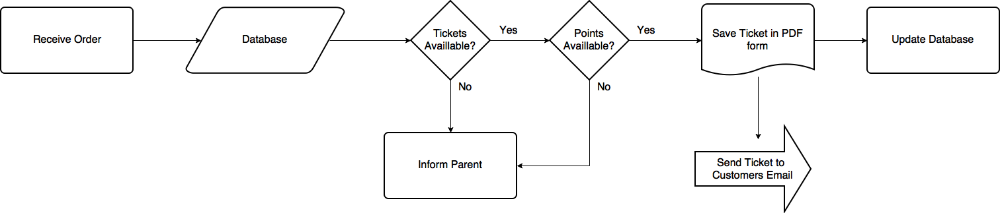
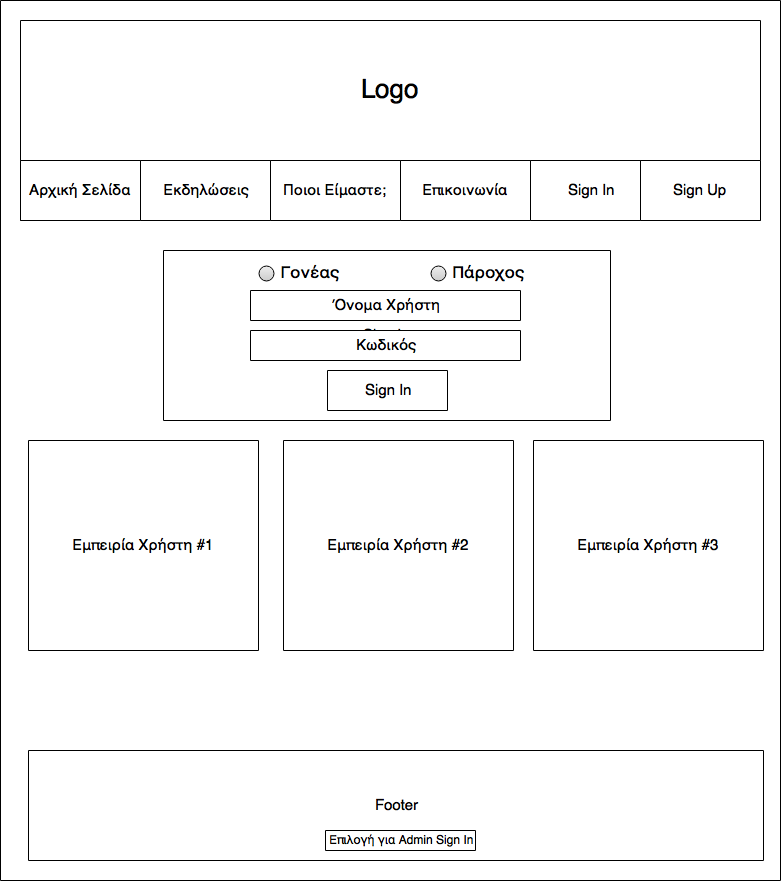
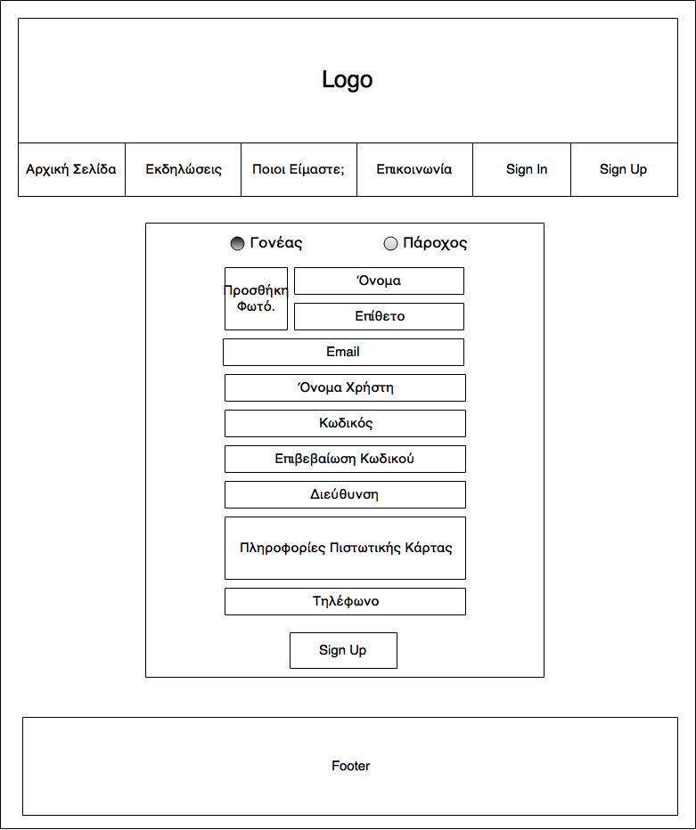
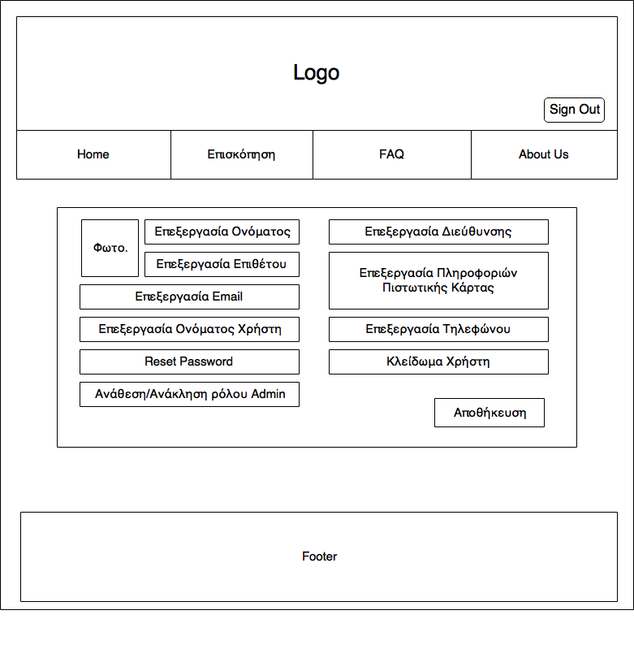
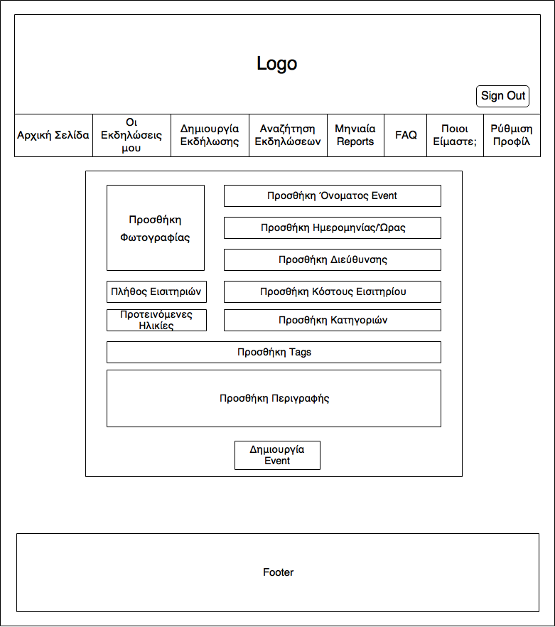

	

 

## Αναφορά Ανάλυσης Απαιτήσεων

 
 
 
 
 

### Η ομάδα

- Αβδελάς Λεωνίδας (@LoniasGR) AM: 3113182
- Μητρόπουλος Κωνσταντίνος (@tsikos7) AM: 3113169
- Μπαξόπουλος Γεώργιος (@georgebax) AM: 3113021
- Ορφανουδάκης Φίλιππος (@PhilOrfan) AM: 3113140
- Σινάνι Κλαούντιο (@klauscfhq) AM: 3113623
- Στυλιανίδης Χρήστος (@Jezulas) AM: 3113130

 
 

### Σκοπός του Συστήματος

Στα πλαίσια της εργασίας αυτής θα κατασκευάσουμε μια διαδικτυακή πλατφόρμα η οποία θα απευθύνεται σε γονείς που σκοπεύουν να κανονίσουν εξωσχολικές δραστηριότητες για τα παιδιά τους.

Συγκεκριμένα, σκοπός του συστήματος είναι η συλλογή των διάφορων δραστηριοτήτων για παιδιά, που συμβαίνουν στην πόλη σε μία διαδικτυακή πλατφόρμα, από όπου θα μπορούν όλοι οι Χρήστες-Γονείς να βρίσκουν με ευκολία δραστηριότητες για τα παιδιά τους. Επίσης σκοπός της πλατφόρμας είναι η διευκόλυνση διαφόρων τοπικών παρόχων δραστηριοτήτων να φέρουν κόσμο στα events/δραστηριότητές τους.

Αντικειμενικός στόχος είναι φυσικά η ικανοποίηση των αναγκών των παιδιών και γονιών, ενώ απαραίτητη είναι και η εξαγωγή κέρδους, με τρόπους που θα αναλυθούν στη συνέχεια.

### Κατηγορίες Χρηστών

Οι χρήστες της πλατφόρμας αυτής θα είναι:

- **Ανώνυμοι Χρήστες**: Χρήστες που δεν έχουν κάνει Sign In στην πλατφόρμα. Οι χρήστες αυτοί μπορούν να κάνουν κανονικά αναζήτηση δραστηριοτήτων, να δουν τις πληροφορίες της εκάστοτε δραστηριότητας, αλλά δεν μπορούν να κάνουν αγορά εισιτηρίου. Μπορούν επίσης να επικοινωνήσουν με τους Διαχειριστές για οποιαδήποτε πληροφορία.
- **Γονείς**: Χρήστες που έχουν κάνει Sign In στην πλατφόρμα ως Γονείς και επιθυμούν να βρούν δραστηριότητες για τα παιδιά τους. Αυτοί οι χρήστες έχουν πρόσβαση σε όλες τις λειτουργίες που αναφέρονται πιο κάτω, όπως περιήγηση στις δραστηριότητες, αγορά εισιτηρίου για όποια δραστηριότητα επιθυμούν, αλλαγή των πληροφοριών του προφίλ τους και άλλα.
- **Πάροχοι Υπηρεσιών**: Χρήστες που έχουν κάνει Sign In ως Πάροχοι Υπηρεσιών και επιθυμούν να προσθέσουν στον κατάλογο τις δραστηριότητες που οργανώνουν, ώστε να έχουν πρόσβαση σε αυτές οι Γονείς. Οι χρήστες αυτοί μπορούν να προσθέσουν δραστηριότητες.
- **Διαχειριστές**: Χρήστες υπεύθυνοι για τη διαχείριση της πλατφόρμας και την ομαλή λειτουργία της. Οι χρήστες αυτοί μπορούν να επεξεργαστούν πληροφορίες όλων των χρηστών, να αναθέσουν και να ανακαλέσουν ρόλους και δικαιώματα και να κλειδώσουν λογαριασμούς.

- **Stakeholders**: Θεωρούμε οτι stakeholders της πλατφόρμας είναι όσοι έχουν οικονομικό όφελος από την επιτυχή λειτουργία της. Αυτοί είναι οι ιδιοκτήτες της και οι Πάροχοι Υπηρεσιών που επιθυμούν να προμοτάρουν τις δραστηριότητες τους.

### Δυνατότητες Χρηστών

Οι διάφοροι χρήστες θα έχουν οποιαδήποτε στιγμή τις εξής δυνατότητες:

- **Ανώνυμοι Χρήστες**
	- Να μπορούν να γνωρίσουν τον σκοπό και τα διάφορα features της πλατφόρμας που θα φαίνονται στην Αρχική Σελίδα.
	- Να μπορούν να δουν τις διαθέσιμες δραστηριότητες
	- Να μπορούν να γίνουν εγγεγραμένοι χρήστες (Register) ως Γονείς ή ως Πάροχοι Υπηρεσιών.
	- Να μπορούν να επικοινωνήσουν με τους ιδιοκτήτες της πλατφόρμας.
	- Να μπορούν να λύσουν κάποιες απορίες τους βλέποντας το σχετικο FAQ (Frequently Asked Questions) section.

- **Γονείς**
	- Κατά την εγγραφή τους οι Γονείς θα πρέπει να παρέχουν στο σύστημα τις εξής πληροφορίες:
		- Ονοματεπώνυμο
		- Email
		- Username
		- Κωδικό πρόσβασης
		- Τόπος διαμονής (διέυθυνση και ταχυδρομικό κώδικα)
		- Αριθμό τραπεζικού λογαριασμού
		- (Optional) Φωτογραφία
		- Τηλέφωνο
	- Να μπορούν να βρουν τις διαθέσιμες δραστηριότητες στην περιοχή τους.
	- Να μπορούν να ψάξουν για δραστηριότητες με βάση συγκεκριμένα κριτήρια όπως:
		- Ημερομηνία
		- Περιοχή ή Διεύθυνση
		- Προτεινόμενες ηλικίες
		- Κατηγορία Δραστηριότητας
		- Κόστος
	- Να μπορούν να κάνουν search για συγκεκριμένες δραστηριότητες.
	- Να έχουν πρόσβαση σε ιστορικό προηγούμενων αγορών τους.
	- Να έχουν πρόσβαση σε στοιχεία επικοινωνίας με τον πάροχο.
	- Να μπορούν να προσθέσουν πόντους στο ηλεκτρονικό τους πορτοφόλι (Wallet) οποιαδήποτε στιγμή με διάφορες πιστωτικές μεθόδους (credit card, debit card etc).
	- Να μπορούν να αλλάξουν τα στοιχεία του λογαριασμού τους.
	- Να μπορούν να επικοινωνήσουν με τους ιδιοκτήτες της πλατφόρμας.
	- Να μπορούν να λύσουν κάποιες απορίες τους βλέποντας το σχετικο FAQ (Frequently Asked Questions) section.
	- Να δέχονται email με το ηλεκτρονικό τους εισητήριο για κάθε δραστηριότητα που κλείνουν.

- **Πάροχοι Υπηρεσιών**
	- Κατά την εγγραφή τους οι Πάροχοι Υπηρεσιών θα πρέπει να παρέχουν στο σύστημα τις εξής πληροφορίες:
		- Ονοματεπώνυμο
		- Email
		- Username
		- Κωδικό πρόσβασης
		- ΑΦΜ
		- Τηλέφωνο
		- Διεύθυνση της Επιχείρησης και ταχυδρομικό κώδικα
		- Όνομα Επιχείρησης
		- Στοιχεία τραπεζικού λογαριασμού
		- (Optional) Περιγραφή
		- (Optional) Εικόνα
	- Να μπορούν να προσθέσουν τις δραστηριότητες που παρέχουν. Σε αυτές τις δραστηριότητες θα πρέπει να παρέχουν τις εξής πληροφορίες:
		- Όνομα δραστηριότητας
		- Ημέρα και ώρα διεξαγωγής (έναρξη και λήξη)
		- Διεύθυνση διεξαγωγής και ταχυδρομικό κώδικα
		- Αριθμό διαθέσιμων εισητηρίων
		- Κόστος εισητηρίου
		- Κατηγορία δραστηριότητας
		- Ελάχιστη και μέγιστη ηλικία συμμετοχής
		- Περιγραφή
	- Να μπορούν να βλέπουν τις κρατήσεις που έχουν γίνει και τον αριθμό των συμμετεχόντων.
	- Να μπορούν να βλέπουν το ιστορικό των δραστηριοτήτων τους, και να δουν μηνιαία reports με τα συνολικά εισιτήρια ανά δραστηριότητα και τα αντίστοιχα ποσά απευθείας σε ευρώ.
	- Να μπορούν να αλλάξουν τα στοιχεία του λογαριασμού τους.
	- Να μπορούν να επικοινωνήσουν με τους ιδιοκτήτες της πλατφόρμας.
	- Να μπορούν να λύσουν κάποιες απορίες τους βλέποντας το σχετικο FAQ (Frequently Asked Questions) section.

- **Διαχειριστές**
	- Να μπορούν να διαχειριστούν πληροφορίες χρηστών.
	- Να μπορούν να αναθέσουν και να ανακαλέσουν ρόλους και δικαιώματα χρηστών.
	- Να μπορούν να προσθέτουν πόντους σε λογαριασμούς χρηστών.
	- Να μπορούν να κλειδώσουν χρήστες (ban).
	- Να μπορούν να κάνουν reset password χρήστη.

### Περιορισμοί

- Όταν κάποιος Πάροχος κάνει SignUp γίνεται έλεγχος για το αν έχει γινει Ban στο παρελθόν από την πλατφόρμα. Αν δεν είχε γίνει, τότε αναμένεται επιβεβαίωση της διαδικασίας εγγραφής του από τους διαχειριστές της πλατφόρμας.
- Επιστροφές από πόντους σε χρήματα δεν γίνονται.
- Οι κρατήσεις επιβεβαιώνονται από εμάς και αρκεί η επίδειξη του εντύπου για τη συμμετοχή του παιδιού στη δραστηριότητα. Ο πάροχος πρέπει να συμφωνήσει σε αυτή τη διαδικασία για τη συμμετοχή του στην πλατφόρμα
- Ο πάροχος δεν μπορεί να τροποποιήσει τις εκδηλώσεις του.
- Ο αριθμός θέσεων για κάθε δραστηριότητα είναι περιορισμένος από κάποιο νούμερο.
- Τα χρήματα των Γονέων που μετατράπηκαν σε πόντους στο ηλεκτρονικό τους πορτοφόλι έχουν μεταφερθεί σε εναν λογαριασμό της πλατφόρμας. Αυτά τα χρήματα δεν μπορούν να χρησιμοποιηθούν εκτός από το να πληρωθεί κάποια δραστηριότητα.
- Αν κάποιος πάροχος που έχει γίνει Ban στο παρελθόν (έλεγχος του ΑΦΜ κατά το register) προσπαθήσει να φτιάξει καινούριο λογαριασμό, απορρίπτεται η προσπάθεια του.

### Παραδοχές

- Οι Πάροχοι Υπηρεσιών έχουν αποδεχθεί ότι για τη συμμετοχή στην δραστηριότητα που παρέχουν αρκεί το χαρτί που δίνεται από την πλατφόρμα στους Γονείς κατα την ολοκλήρωση της συναλλαγής.
- Αν κάποιες διαθέσιμες θέσεις μιας δραστηριότητας καλυφτούν εκτός της πλατφόρμας, τότε οφείλει ο πάροχος να ενημερώσει το σύστημα άμεσα για να μην δημιουργηθούν προβλήματα.
- Ένα ευρώ αντιστοιχεί σε έναν πόντο.

### Εμβέλεια του συστήματος

- Εμπίπτει στον σύστημα η επιβεβαίωση της κράτησης. Για τη συμμετοχή στη δραστηριότητα αρκεί το χαρτί που παρέχει η πλατφόρμα στον χρήστη μετά τη συναλλαγή.
- Η ακύρωση εκδηλώσεων δεν εμπίπτει στο σύστημα, ούτε από τη μεριά του παρόχου ούτε από τη μεριά του γονέα.
- Η επικοινωνία μεταξύ παρόχου και γονέα γίνεται εκτός της πλατφόρμας. Δεν υπάρχει δηλαδή δυνατότητα τύπου Chat στο πλαίσιο της πλατφόρμας, απλά δίνονται στο γονέα τα στοιχεία του παρόχου για επικοινωνία.

### Πολιτική Εισιτηρίων

- Κατά την ολοκλήρωση της αγοράς ενός εισιτηρίου ο Γονέας δέχεται ενα mail με το εισιτήριο. Το εισιτήριο αυτο αρκεί για τη συμμετοχή των παιδιών του στη δραστηριότητα.

### Βιωσιμότητα Πλατφόρμας

- Το κέρδος προκύπτει με χρέωση μηνιαίου ποσού στους Παρόχους Υπηρεσιών, μέσω συνδρομής. Επιπλέον, προκειμένου να επιτευχθεί μεγαλύτερη κίνηση στην πλατφόρμα, θα υπάρχει bonus επιβράβευσης σε πόντους προς τους γονείς κάθε φορά που ολοκληρώνουν συγκεκριμένο αριθμό συναλλαγών.

 
 

## Αναφορά Τεχνικών Προδιαγραφών

 
 
 
 
 

### Επιχειρησιακός Στόχος

Στόχος του Candyland είναι η αύξηση του κέρδους των Stakeholders της εφαρμογής. Συγκεκριμένα στόχος για τους παρόχους είναι η αύξηση της δημοτικότητας των εκδηλώσεων τους μέσω της εφαρμογής, ενώ για τους ιδιοκτήτες το κέρδος από την προμήθεια που θα πληρώνουν οι πάροχοι. Η εφαρμογή φροντίζει στην επίτευξη των στόχων αυτών με τους εξής κανόνες:

- Ο πάροχος εγγράφεται στην πλατφόρμα παρέχοντας τις πληροφορίες του τραπεζικού του λογαριασμού από τον οποίο θα κάθε μήνα θα πληρώνεται η πλατφόρμα το ποσό των 50€. Το ποσό αυτό θα αποτελεί το μοναδικό κέρδος της επιχείρισης.
- Ο Γονέας εγγράφεται στην πλατφόρμα παρέχοντας επίσης τις πληροφορίες της πιστωτικής/χρεωστικής του κάρτα από την οποίο θα μπορεί να προσθέτει πόντους στο ηλεκτρονικό του πορτοφόλι (E-Wallet)
- Κάθε γονέας μπορεί οποτεδήποτε να προσθέσει πόντους στο E-Wallet του. Η αναλογία πόντων/ευρώ είναι 1:1, δηλαδή 1 πόντος = 1 ευρώ. 
- Δεν υποστηρίζεται μετατροπή από πόντους σε ευρώ.
- Το σύστημα υποστηρίζει σύστημα επιβράβευσης πόντων, κατά το οποίο κάθε φορά που 4 αγορές εισιτηρίων ολοκληρώνονται από τον Γονέα, προσθέτονται 10 επιπλέον πόντοι στο λογαριασμό του.

 
 

### Μοντελοποίηση και Σχεδιασμός

- Γενικές σχεδιαστικές λεπτομέρειες
	- Η πλατφόρμα έχει σχεδιαστεί στα ελληνικά.
	- Η εφαρμογή θα είναι πλήρως λειτουργική και προσβάσιμη τόσο από Desktop, όσο και από Tablet και Mobile συσκευές.
	- Υποστηρίζει την αναζήτηση εκδηλώσεων με διάφορα κριτήρια, μεταξύ των οποίων και της γεωγραφικής τοποθεσίας που επιλέγει ο Γονέας. Αυτό επιτυγχάνεται με τη χρήση Google Maps.
	- Το λογότυπο της εταιρίας θα φαίνεται σε μορφή watermark στις φωτογραφίες που ανεβάζονται από τους χρήστες

- Αναζήτηση Δραστηριοτήτων
	- Παρέχεται ένα Search Bar αναζήτησης ελεύθερου κειμένου, λειτουργικότητα που περιλαμβάνεται στο Materialize Framework που χρησιμοποιούμε.
	- Δυνατότητα εφαρμογής φίλτρων όπως ημερομηνία, περιοχή ή διεύθυνση, προτεινόμενες ηλικίες, κατηγορίες δραστηριότητας, κόστος.
	- Τα αποτελέσματα θα εμφανίζονται αρχικά σε ένα χάρτη με pins στις τοποθεσίες των αποτελεσμάτων και μετά σε μία λίστα.

Για τη σωστή λειτουργία της εφαρμογής είναι απαραίτητη η μοντελοποίηση μερικών απαραίτητων διαδικασιών που μπορεί να μην είναι προφανείς. Ακολουθούν μερικά Flowcharts για τις πιο σύνθετες ενέργειες που μπορούν να εκτελέσουν οι γονείς και οι πάροχοι.

#### Flowcharts

##### Insert OrderFlowchart image
Flowchart για την διαδικασία αγοράς εισιτηρίου για κάποια εκδήλωση

 

			
		

 

##### Insert AddPointsWallet image
Flowchart για την διαδικασία προσθήκης πόντων στο E-Wallet του Γονέα

 

			
		

 

##### Insert SignupProvider image
Flowchart για την διαδικασία SignUp του Παρόχου

 

			
		

 

Τώρα ακολουθεί ένα απλό Decision Tree για το σύστημα επιβάβευσης Γονέων για τη χρήση της πλατφόρμας με πόντους.

##### Insert BonusProvider image
Decision Tree για το σύστημα επιβράβευσης πόντων

 
 
 

### Αρχιτεκτονική και Συστατικά (Klaus και μπαξο πλιζ do that shit)

Όσων αφορά το τεχνικό κομμάτι της Εφαρμογής, καταλήξαμε ότι αυτή θα υλοποιηθεί χρησιμοποιώντας τις εξής τεχνολογίες.

- Design Language: Material Design
- Frontend: Για το UI της εφαρμογής χρησιμοποιούμε Angular2 JS. Η γλώσσα αυτή μας επιτρέπει τη χρήση του Material Design Framework, το οποίο προσφέρει τα σημαντικά πλεονέκτημα ενός του καθαρού, responsive, cross-device, immersive design.
- Database: Η βάση δεδομένων μας θα βασίζεται στη MySQL
- Backend: Για το backend χρησιμοποιούμε Java και το Spring Framework. Με το Spring Boot έχουμε τη δυνατότητα να σχεδιάσουμε RESTful API και σημαντικά πιο καθαρό κώδικα, ιδίως όσον αφορά τα web services, ενώ η Java έχει τα πλεονεκτήματα του Object Oriented Programming. 
- Project Management: Χρησιμοποιούμε το Apache Maven για τη διαχείριση του project και των dependencies του backend, ενώ για του frontend χρησιμοποιούμε το npm (NodeJS Package Manager).
- Dependencies: Στα dependencies του project μας συμπεριλαμβάνονται προς το παρόν στο pom.xml του Maven : 
Το Junit Framework (για το testing του Java κώδικα στο backend), 
Το Hibernate (για διαχείριση της βάσης), 
Το Spring Boot (και αρκετά artifacts του Spring που έχουν χρειαστεί μέχρι στιγμής)
Το lettuce, που χρειάζεται για session management (lettuce.io)
Το javax.mail package, ώστε να μπορούμε να κάνουμε 2 step verification με κωδικό που αποστέλλεται μέσω email. 

Το βασικό dependency του project, δηλαδή το εργαλείο που προσθέτει watermark στις εικόνες, υπάρχει ως standalone project στο candyland-dependency repository, με οδηγίες για το πώς μπορεί να χρησιμοποιηθεί.

Ακολουθεί το ER Diagram της βάσης δεδομένων μας:

	

#### Στα παραπάνω χώνουμε και τα UML(class component whatever)/ER Diagrams thingies

 
 

### Google Maps

Θα χρησιμοποίησουμε το Google Maps API για την εμφάνηση χαρτών στην εφαρμογή μας. Στον χάρτη αυτό θα μπορούμε να τοποθετήσουμε pins για τις εκδηλώσεις που βρίσκονται σε κάποια ακτίνα γύρω από τον γονέα ή την περιοχή που έχει επιλέξει.

 
 

### Υδατογράφημα (watermark)
https://github.com/ImageMagick/ImageMagick
Το watermark που χρησιμοποιείται για τις εικόνες που ανεβαίνουν στην πλατφόρμα, είναι ένα ξεχωριστό binary dependency. Το npm package που χρησιμοποιούμε είναι το imagemagick. Ένα live demo της λειτουργίας του watermark μας βρίσκεται διαθέσιμο στο [watermark](https://candyland-dep.herokuapp.com)
 
 

### Use Cases

Ακολουθεί το γενικό Use Case της πλατφόρμας:

	

### Λεπτομερής προδιαγραφή Λειτουργιών που υποστηρίζονται από το λογισμικό (χώνουμε και wireframes/umls εδώ)

#### Use Case Diagrams

Ακολουθεί ενα γενικό Use Case diagram της λειτουργίας της πλατφόρμας:

	

Πιο αναλυτικά για τη Διαχείριση Χρηστών:

	

Πιο αναλυτικά για την Αναζήτηση Δραστηριοτήτων:

	

Πιο αναλυτικά για τη Δημιουργία Λογαριασμού/Sign Up:

	

Το περιεχόμενο των παραπάνω Use Cases γίνεται κατανοητό με την επεξήγηση των παρακάτω UML Diagrams.

#### UML Diagrams

Οι λειτουργίες και η διαδικασία πλοήγησης των χρηστών μέσα στην πλατφόρμα συνοψίζονται παρακάτω με τη μορφή διαγραμμάτων. Στα UML diagrams τα κυρτά παραλληλόγραμμα δηλώνουν σύνδεση με άλλο UML diagram στο οποίο αναλύεται η διαδικασία πλοήγησης των σελίδων που αφορούν την συγκεκριμένη ομάδα. Τα σχήματα με πράσινο φόντο συνεπάγονται την ύπαρξη wireframe για την συγκεκριμένη σελίδα ενώ αυτά με κόκκινο φόντο δεν συνοδεύονται από wireframe (δεν κρίθηκε απαραίτητη η δημιουργία κάποιου wireframe).

#### Ανώνυμος Χρήστης
- Μπορεί να δει τη λίστα FAQ, να επικοινωνήσει με τους admin μέσω της σελίδας Επικοινωνία και να μάθει για τους δημιουργούς της πλατφόρμας από τη σελίδα Ποιοι είμαστε.

- Μπορεί να δει και να ψάξει για εκδηλώσεις, με χρήση φίλτρων, αναζήτηση ελεύθερου κειμένου κτλ.

- Μπορεί να μεταφερθεί στη σελίδα sign-up ώστε να δημιουργήσει λογαριασμό.

- Σε περίπτωση που ο χρήστης έχει λογαριασμό, μπορεί να κάνει sign-in για να μεταβεί στην κατάλληλη σελίδα.

	

#### Γονέας
- Μπορεί να κάνει τις ίδιες ενέργειες με τον ανώνυμο χρήστη.

- Επιπλέον μπορεί να τροποποιήσει τις πληροφορίες του προφίλ του από την σελίδα Ρυθμίσεις Προφίλ.

- Μπορεί να επιλέξει κάποια δραστηριότητα από τη λίστα δραστηριοτήτων, να μεταβεί στη σελίδα της δραστηριότητας και να κλείσει ηλεκτρονικά εισιτήρια για αυτήν.

- Μπορεί να δει πληροφορίες για το ηλεκτρονικό πορτοφόλι του και να προσθέσει πόντους από τη σελίδα E-Wallet.

	

#### Πάροχος
- Μπορεί να κάνει τις ίδιες ενέργειες με τον ανώνυμο χρήστη.

- Επιπλέον μπορεί να τροποποιήσει τις πληροφορίες του προφίλ του από τη σελίδα Ρυθμίσεις Προφίλ.

- Μπορεί να δημιουργήσει νέες εκδηλώσεις ορίζοντας όλες τις απαραίτητες πληροφορίες από τη σελίδα Δημιουργία Εκδήλωσης.

- Μπορεί να έχει πρόσβαση στο ιστορικό των events του από τη σελίδα History.

- Μπορεί να έχει πρόσβαση σε στατιστικά περασμένων events από τη σελίδα Μηνιαία Reports.

	

#### Διαχειριστής
- Μπορεί να κάνει τις ίδιες ενέργειες με τον ανώνυμο χρήστη. 

- Μπορεί να διαχειριστεί (τροποποιήσει πληροφορίες, κλειδώσει) λογαριασμούς γονέων από τη Σελίδα Διαχείρησης Γονέα.

- Μπορεί να διαχειριστεί (τροποποιήσει πληροφορίες, κλειδώσει) λογαριασμούς παρόχων από τη Σελίδα Διαχείρησης Παρόχου.

#### Wireframes
- Παρακάτω παρουσιάζονται τα βασικότερα wireframes της εφαρμογής όπως αυτά προέκυψαν από την ανάλυση απαιτήσεων και τα παραπάνω διαγράμματα πλοήγησης UML.

- Wireframes για τις σελίδες που προβάλονται πριν κάνει ο χρήστης login:
	- Η αρχική σελίδα της εφαρμογής:
		

			
		

	- Το sign-up page των γονέων:
		

			
		

	- Το sign-in page των admins:
		

			
		

- Wireframes για τις σελίδες που αφορούν τους admins:
	- Η αρχική σελίδα των admins:
		

			
		
	
- H σελίδα από την οποία οι admins μπορούν να τροποποιήσουν λογαριασμούς γονέων:
		

			
		

	- H σελίδα από την οποία οι admins μπορούν να τροποποιήσουν λογαριασμούς παρόχων:
		

			
		

- Wireframes για τις σελίδες που αφορούν τους parents:
	- Η σελίδα του ηλεκτρονικού πορτοφολιού του γονέα:
		

			
		

	- Η σελίδα από την οποία ο γονέας θα μπορεί να αλλάξει πληροφορίες του προφίλ του:
		

			
		

	- Η σελίδα με τις πληροφορίες ενός event:
		

			
		

	- Η σελίδα με τα αποτελέσματα αναζήτησης των events:
		

			
		

- Wireframes για τις σελίδες που αφορούν τους providers:
	- Η σελίδα δημιουργίας ενός νέου event:
		

			
		

	- Η σελίδα από την οποία ο πάροχος θα μπορεί να αλλάξει πληροφορίες του προφίλ του: 
		

			
		

	- Η σελίδα με το ιστορικό των events του παρόχου:
		

			
		

	- Η σελίδα με το report των μηνιαίων στατιστικών του παρόχου:
		

			
		

	- Η λίστα με τα events του παρόχου:
		

			
		

